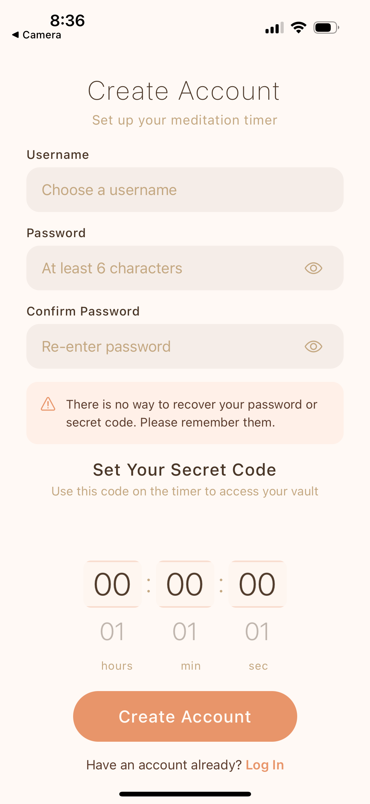
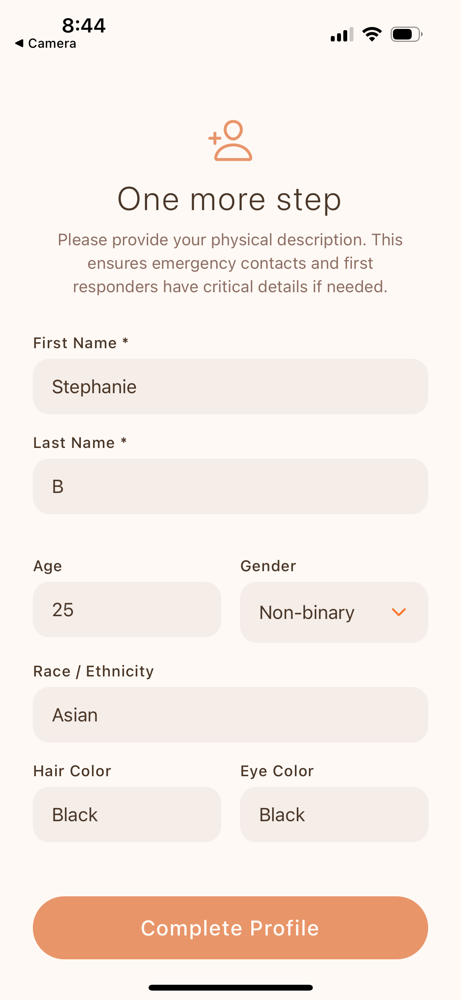
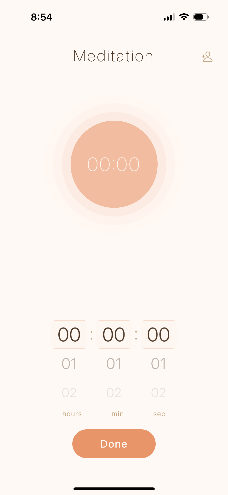
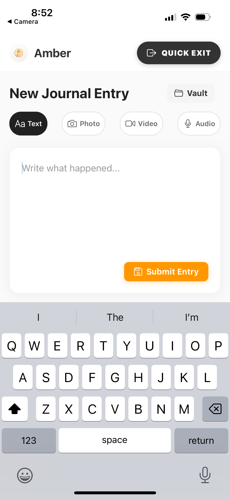
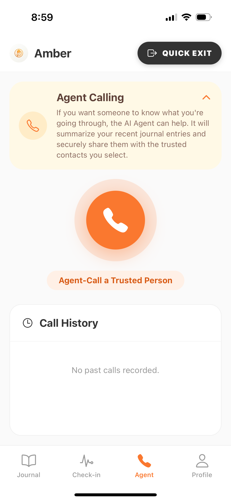
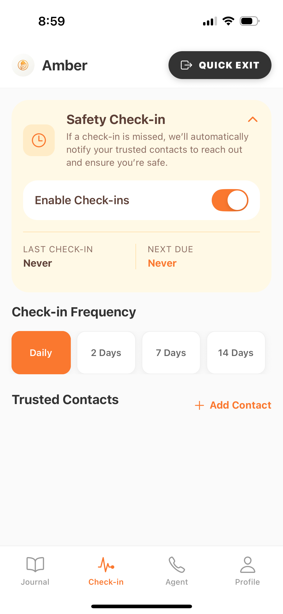
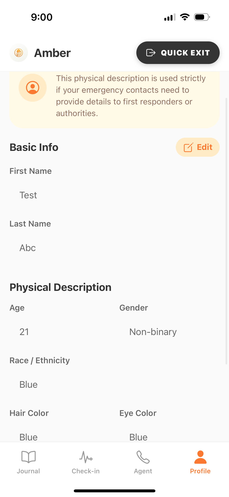

<p align="center">
  
</p>

<h1 align="center">Amber</h1>

<p align="center">
  A DV evidence collection app disguised as a meditation timer.<br/>
  Built at <strong>Hack for Humanity 2026</strong> — Santa Clara University.
</p>

---

## Screenshots

<table>
  <tr>
    <td align="center" width="25%">
      <br/>
      <strong>Sign Up Page</strong>
    </td>
    <td align="center" width="25%">
      <br/>
      <strong>We collect more User Info.</strong>
    </td>
    <td align="center" width="25%">
      <br/>
      <strong>Sign In Page</strong>
    </td>
    <td align="center" width="25%">
      <br/>
      <strong>What the app opens to once you are signed in</strong>
    </td>
  </tr>
  <tr>
    <td align="center" width="25%">
      <br/>
      <strong>Vault Tab</strong><br/>
      Securely store evidence. Everything is encrypted and hashed with metadata (GPS, timestamps) preserved for legal use.
    </td>
    <td align="center" width="25%">
      <br/>
      <strong>Agent Tab</strong><br/>
      Set up automated calls to your trusted contacts.
    </td>
    <td align="center" width="25%">
      <br/>
      <strong>Check-In Tab</strong><br/>
      Dead man's switch. Set a check-in frequency. If you miss one, tiered escalation kicks in.
    </td>
    <td align="center" width="25%">
      <br/>
      <strong>Profile Tab</strong><br/>
      Can be edited if user changes their appearance.
    </td>
  </tr>
</table>

---
## Stack

- **Mobile**: React Native (Expo SDK 54, TypeScript)
- **Backend**: FastAPI (Python 3.11)
- **Database**: Supabase (PostgreSQL + Storage)
- **Storage Bucket**: Ensure a public or RLS-protected bucket named `amber-vault` exists in Supabase.
- **Orchestration**: LangGraph + Groq (Llama)

## Prerequisites

- **Node**: `20.x` (see `.nvmrc`)
- **Python**: `3.11.x` (see `.python-version`)
- **Mobile Preview**: Install the **Expo Go** app on your phone.

## Quickstart

### 1. Initial Setup
```bash
git clone <repo-url>
cd Amber
npm install
```

### 2. Backend Setup
We use a Python virtual environment for the API.
```bash
# Create and activate venv
python3 -m venv venv
source venv/bin/activate

# Install dependencies
npm run api:install

# Start the API
npm run api:dev
```
Verify the backend is running at [http://localhost:8000/health](http://localhost:8000/health).

### 3. Mobile Setup
Open a **new terminal tab** and navigate to the mobile app:
```bash
cd apps/mobile
npm install
```

## Running the App

### Option A: Phone Preview (Recommended)
This uses a tunnel to ensure your phone can connect to your Mac regardless of Wi-Fi/Firewall settings.
```bash
npx expo start --tunnel
```
Scan the QR code with your **Phone Camera** (iOS) or **Expo Go App** (Android).

### Option B: iOS Simulator
*Requires Xcode installed.*
```bash
npx expo start --ios -c
```

### Option C: Android Emulator
*Requires Android Studio / ADB set up.*
```bash
npx expo start --android
```

## Common Commands

- **Format Code**: `npm run fmt`
- **Lint Check**: `npm run lint`

## Troubleshooting

- **"Opening project..." hang**: Always use `npx expo start --tunnel` if you are on a public/corporate Wi-Fi.
- **Python not found**: Ensure you are using `python3` and that your `venv` is activated.
- **Expo Go version error**: This project is pinned to SDK 54 for maximum compatibility. If Expo Go suggests an update, ensure you are running the `npx expo start --tunnel` command.
